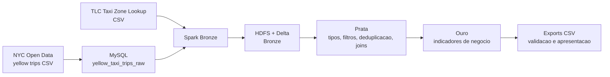

# NYC Taxi Medallion Lakehouse

Projeto pratico de engenharia de dados para demonstrar uma arquitetura
Medallion em Delta Lake, usando dados reais e duas origens:

- MySQL com viagens brutas de taxi amarelo, carregadas a partir de CSV publico.
- CSV oficial `taxi_zone_lookup.csv`, usado para enriquecer origem/destino.

O fluxo passa por HDFS e organiza os dados nas camadas Bronze, Prata e Ouro.

## Dataset usado

Fonte principal: 2023 Yellow Taxi Trip Data, publicado no portal NYC Open Data.
O dataset possui registros reais de viagens, com horarios, origem, destino,
distancia, valores, taxas, gorjeta e forma de pagamento.

Fonte auxiliar: Taxi Zone Lookup, publicado pela NYC Taxi & Limousine Commission.
Ele identifica bairro, zona e service zone para cada `LocationID`.

Os scripts baixam uma amostra configuravel do dataset oficial para facilitar a
execucao em sala, sem depender de um arquivo de varios gigabytes.

## Arquitetura



## Camadas

Bronze:

- `bronze.yellow_trips_mysql`: snapshot semi-bruto das viagens carregadas no MySQL.
- `bronze.taxi_zones_csv`: lookup de zonas lido do CSV oficial.

Prata:

- `silver.trips_enriched`: viagens tipadas, filtradas, deduplicadas, com metricas
  derivadas e nomes de borough/zona para origem e destino.
- Regras de qualidade: distancia maior que zero, valores nao negativos, horario
  de desembarque posterior ao embarque, passageiros validos e localizacoes
  existentes.

Ouro:

- `gold.revenue_by_borough_hour`: receita, corridas e gorjeta por bairro e hora.
- `gold.zone_performance`: desempenho por zona de embarque.
- `gold.payment_summary`: comparacao por forma de pagamento.
- `gold.revenue_by_date`: receita diaria.
- `gold.top_pickup_zones`: top 10 zonas por volume.
- `gold.data_quality_summary`: contagem de registros brutos, validos e removidos.

## Estrutura dos jobs

- `jobs/01_bronze.py`: le MySQL e CSV, grava Delta Bronze.
- `jobs/02_prata.py`: limpa, tipa, deduplica e enriquece os dados.
- `jobs/03_ouro.py`: cria tabelas analiticas.
- `jobs/04_pipeline_completo.py`: orquestra Bronze, Prata, Ouro e validacao.
- `jobs/05_validacao.py`: mostra contagens, schemas, amostras e consultas SQL.
- `jobs/export_gold.py`: exporta tabelas Ouro para CSV.

## Requisitos

- Docker Desktop aberto e rodando.
- PowerShell.
- Python 3.10+.

## Como executar

Entre na pasta do projeto:

```powershell
cd "C:\Users\halva\OneDrive\Área de Trabalho\codex\nyc-taxi-medallion-lakehouse"
```

Crie o ambiente Python local. No PowerShell, nao e necessario ativar o ambiente:

```powershell
python -m venv .venv
.\.venv\Scripts\python.exe -m pip install -r requirements.txt
```

Execute tudo:

```powershell
.\scripts\run_all.ps1
```

O `run_all.ps1` faz:

1. Baixa dados publicos reais.
2. Sobe MySQL, HDFS e Spark com Docker Compose.
3. Carrega `yellow_taxi_trips_raw` e `taxi_zones` no MySQL.
4. Executa Bronze, Prata, Ouro e Validacao.
5. Exporta as tabelas Ouro para `data/gold_exports`.

## Execucao manual por etapas

Baixar os dados:

```powershell
.\.venv\Scripts\python.exe .\scripts\download_sources.py --limit 75000
```

Subir ambiente:

```powershell
docker compose up -d
```

Carregar MySQL:

```powershell
.\.venv\Scripts\python.exe .\scripts\load_mysql_seed.py
```

Bronze:

```powershell
docker compose exec spark-master spark-submit --packages io.delta:delta-spark_2.12:3.2.0,com.mysql:mysql-connector-j:8.4.0 --conf "spark.sql.extensions=io.delta.sql.DeltaSparkSessionExtension" --conf "spark.sql.catalog.spark_catalog=org.apache.spark.sql.delta.catalog.DeltaCatalog" /opt/bitnami/spark/jobs/01_bronze.py
```

Prata:

```powershell
docker compose exec spark-master spark-submit --packages io.delta:delta-spark_2.12:3.2.0 --conf "spark.sql.extensions=io.delta.sql.DeltaSparkSessionExtension" --conf "spark.sql.catalog.spark_catalog=org.apache.spark.sql.delta.catalog.DeltaCatalog" /opt/bitnami/spark/jobs/02_prata.py
```

Ouro:

```powershell
docker compose exec spark-master spark-submit --packages io.delta:delta-spark_2.12:3.2.0 --conf "spark.sql.extensions=io.delta.sql.DeltaSparkSessionExtension" --conf "spark.sql.catalog.spark_catalog=org.apache.spark.sql.delta.catalog.DeltaCatalog" /opt/bitnami/spark/jobs/03_ouro.py
```

Validacao:

```powershell
docker compose exec spark-master spark-submit --packages io.delta:delta-spark_2.12:3.2.0 --conf "spark.sql.extensions=io.delta.sql.DeltaSparkSessionExtension" --conf "spark.sql.catalog.spark_catalog=org.apache.spark.sql.delta.catalog.DeltaCatalog" /opt/bitnami/spark/jobs/05_validacao.py
```

Exportar Ouro:

```powershell
docker compose exec spark-master spark-submit --packages io.delta:delta-spark_2.12:3.2.0 --conf "spark.sql.extensions=io.delta.sql.DeltaSparkSessionExtension" --conf "spark.sql.catalog.spark_catalog=org.apache.spark.sql.delta.catalog.DeltaCatalog" /opt/bitnami/spark/jobs/export_gold.py
```

## Validacao local

Execute os testes:

```powershell
.\.venv\Scripts\python.exe -m pytest
```

Conferir MySQL:

```powershell
docker compose exec mysql mysql -utaxi -ptaxi123 taxi_dw -e "select count(*) from yellow_taxi_trips_raw; select count(*) from taxi_zones;"
```

Conferir HDFS:

```powershell
docker compose exec namenode hdfs dfs -ls -R /lakehouse
```

Conferir tabela Ouro:

```powershell
docker compose exec spark-master spark-sql --packages io.delta:delta-spark_2.12:3.2.0 --conf "spark.sql.extensions=io.delta.sql.DeltaSparkSessionExtension" --conf "spark.sql.catalog.spark_catalog=org.apache.spark.sql.delta.catalog.DeltaCatalog" -e "select * from delta.`hdfs://namenode:9000/lakehouse/gold/payment_summary` limit 10"
```

## Entregaveis

- Ambiente Docker em `docker-compose.yml`.
- Pipeline modular em `jobs/`.
- Scripts de ingestao em `scripts/`.
- Testes em `tests/`.
- Documentacao tecnica em `docs/`.
- Roteiro e PowerPoint em `apresentacao/`.
